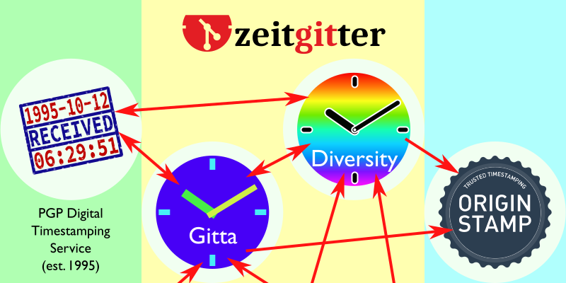

# `git timestamp` — Git Timestamping Client for *Zeitgitter*

## Quick setup

Before you can run `git timestamp` to create a branch timestamp (recommended)
or `git timestamp --tag SomeTimestampedTag` (alternative) in any of your git
repositories, follow these instructions:


### Ubuntu 16.04, 18.04, 19.10, or 20.04 using Python 3

```sh
sudo apt install python3-pip python3-pygit2
sudo pip3 install git-timestamp
```

(Installing `python3-pygit2` is not required in all cases, but not
doing it can lead to strange error messages when running `pip3 install
git-timestamp` in some configurations.)

`pygit2` is a very brittle package with subtle (or not so subtle)
dependencies on system packages. If you want to upgrade
`git-timestamp` later, the following command is recommended:

```sh
sudo pip3 install -U git-timestamp `pip3 freeze | grep pygit2`
```

Freezing `pygit2` in this way can also be needed in other
circumstances and for other packages relying on `pygit2`.

## Timestamping: Why?

Being able to provide evidence that **you had some piece of information at a
given time** and **it has not changed since** are important in many aspects of
personal, academic, or corporate life.

It can help provide evidence
- that you had some idea already at a given time,
- that you already had a piece of code, or
- that you knew about a document at a given time.

Timestamping does not assure *authorship* of the idea, code, or document. It
only provides evidence to the *existence* at a given point in time. Depending
on the context, authorship might be implied, at least weakly.


## *Zeitgitter* for Timestamping

*Zeitgitter* consists of two components:

1. A timestamping client, `git timestamp`, which can add a timestamp as a digital signature to
   an existing `git` repository. Existing `git` mechanisms can then be used
   to distribute these timestamps (stored in commits or tags) or keep them
   private.
2. A timestamping server, `zeitgitterd`, which supports timestamping `git` repositories and
   stores its history of commits timestamped in a `git` repository as well.
   Anybody can operate such a timestamping server, but using an independent
   timestamper provides strongest evidence, as collusion is less likely.
   - Publication of the timestamps history; as well as
   - getting cross-timestamps of other independent timestampers on your
     timestamp history
   both provide mechanisms to assure that timestamping has not been done
   retroactively ("backstamping").

The timestamping client is called `git timestamp` and allows to issue
timestamped, signed tags or commits.

To simplify deployment, we provide a free timestamping server at
[https://gitta.zeitgitter.net](https://gitta.zeitgitter.net).
It is able to provide several
million timestamps per day. However, if you or your organization plan to issue
more than a hundred timestamps per day, please consider installing and using
your own timestamping server and have it being cross-timestamped with other
servers.


## Timestamping as a network

The revolutionary idea behind Zeitgitter is to have timestampers cross-verify
each other. This results in a network which makes it hard to cheat. In fact,
the network requires **only a single trustworthy member** to prevent all
others from cheating. Even more so, you do not need to know who the
non-cheating member is, as long as you can be sure that there is one or not
all the bad guys are colluding.

In fact, the non-cheating member may even change over time. As long as there is
always at least one member who does not backdate any timestamps, this role can
freely move between members.

This extreme resilience makes timestamping with Zeitgitter so trustworthy.




## Client Usage

### Options

```sh
usage: git-timestamp [--help] [--version] [--tag TAG] [--branch BRANCH]
                     [--server SERVER] [--append-branch-name bool]
                     [--gnupg-home GNUPG_HOME] [--enable [bool]]
                     [--require-enable] [--quiet [bool]]
                     [COMMIT]
```
Interface to Zeitgitter, the network of independent GIT timestampers.

positional arguments:
*  **COMMIT**:          Which commit-ish to timestamp. Must be a branch name
                        for branch timestamps with `--append-branch-name`. Can
                        be set by `git config timestamp.commit-branch`;
                        fallback default: 'HEAD'

optional arguments:
* **--help**, **-h**:   Show this help message and exit. When called as `git
                        timestamp` (space, not dash), use `-h`, as `--help` is
                        captured by `git` itself.
* **--version**:        Show program's version number and exit
* **--tag** TAG:        Create a new timestamped tag named TAG
* **--branch** BRANCH:  Create a timestamped commit in branch BRANCH, with
                        identical contents as the specified commit. Default
                        name derived from servername plus `-timestamps`. Can
                        be set by `git config timestamp.branch`
* **--server** SERVER:  Zeitgitter server to obtain timestamp from. 'https://'
                        is optional. The following aliases are supported:
                        gitta → gitta.zeitgitter.net, diversity →
                        diversity.zeitgitter.net. Can be set by `git config
                        timestamp.server`; fallback default:
                        'https://gitta.zeitgitter.net'
* **--append-branch-name** bool:
                        Whether to append the branch name of the current
                        branch to the timestamp branch name, i.e., create per-
                        branch timestamp branches. (`master` will never be
                        appended.). Can be set by `git config
                        timestamp.append-branch-name`; fallback default:
                        'True'
* **--gnupg-home** GNUPG_HOME:
                        Where to store timestamper public keys. Can be set by
                        git config `timestamp.gnupg-home`
* **--enable** [ENABLE]: Forcibly enable/disable timestamping operations;
                        mainly for use in `git config`. Can be set by `git
                        config timestamp.enable`
* **--require-enable**: Disable operation unless `git config timestamp.enable`
                        has **explicitely** been set to true
* **--quiet** [bool], **-q** [bool]
                        Suppress diagnostic messages, only print fatal errors.
                        Can be set by `git config timestamp.quiet`

`--tag` takes precedence over `--branch`. When in doubt, use `--tag` for
single/rare timestamping, and `--branch` for reqular timestamping. `bool`
values can be specified as true/false/yes/no/0/1. Arguments with optional
`bool` options default to true if the argument is present, false if absent.


## Automatic timestamping of every commit

To automatically timestamp every commit, create an executable file
`.git/hooks/post-commit` with the following contents:

```sh
#!/bin/sh
git timestamp
```

Append parameters as you like.

If you do not need parameters (i.e., everything matches the default or has been
overridden with `git config`), and you have no other post-commit needs, run the
following command in the root of your checked out repository:

```sh
ln -s `which git-timestamp` .git/hooks/post-commit
```


## Inclusion in other packages

Timestamping can be a useful add-on feature for many operations, including
verifying whether a repository has been tampered with. For example, we use it
extensively together with [`etckeeper`](https://etckeeper.branchable.com/)
for tamper-evidence.

If you would like to include timestamping as an optional component in your
software, you have to first decide whether timestamping should be *on* or *off*
by default for your software:
* **default-on**: Just call `git timestamp` as normal. Users can disable
  timestamping on a per-repository basis by running
  `git config timestamp.enable false` at any time.
* **default-off**: Timestamp with the option `--require-enable`. Then, users
  have to first run `git config timestamp.enable true` in the repository.
In any case, you should check whether `git timestamp` has been installed before
calling it. In a shell, you could do this as follows:

```sh
if which git-timestamp > /dev/null; then
  git timestamp OPTIONS
fi
```


## General and Client Documentation

- [Timestamping: Why and how?](doc/Timestamping.md)
- [Client installation](doc/Install.md)
- [Protocol description](doc/Protocol.md)
- [List of public *Zeitgitter* servers](doc/ServerList.md)
- [Discussion of the use of (weak) cryptography](doc/Cryptography.md)


# Attributions

Zeitgitter logo is based on [Git Logo](https://git-scm.com/downloads/logos) by
[Jason Long](https://twitter.com/jasonlong), licensed under the
[Creative Commons Attribution 3.0
Unported License](https://creativecommons.org/licenses/by/3.0/).
