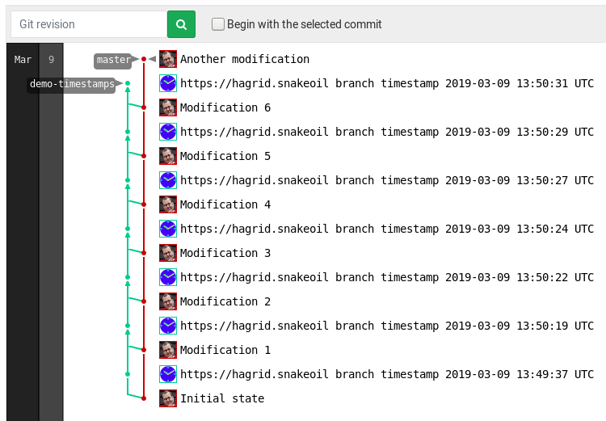

# Client installation

:warning: For server installation information, please visit
[server/Install.md](../server/Install.md).

## Ubuntu >= 18.04, Debian Stretch, Raspbian 9

On these systems, you can install the timestamping client with:

```sh
sudo apt install python3-gnupg python3-pygit2 python3-requests
sudo make install-client
```

## Other packaged systems

* Install `git` (you probably already have this)
* Install Python3 (tested with versions 3.5, 3.6, and 3.7)
* Install GnuPG 2.x (`gpg` binary)
* Install libraries and headers for `libgit2`, `libffi`, and `libssl`

Then run:

```sh
sudo pip3 install python-gnupg pygit2 requests
sudo make install-client
```

:warning: The `pip[3]` package named *just* `gnupg` (no `python-` prefix!) is
incompatible with `zeitgitter` and may need to be *removed* first, to avoid
conflicts between the two packages.


## Other systems

On other systems, you might need to compile things from scratch. Please try to
avoid this, as this is an arduous process. `libgit2` needs to be at least as
new as `pygit2`, otherwise compilation as part of `pip3 install pygit2` will
fail.

* Python 3.x,
* a C compiler,
* the libraries and headers for `libgit2`, `libffi` and `libssl`, and
* the `git` tools, header files, and libraries.

Then run:

```sh
sudo pip3 install python-gnupg pygit2
sudo make install-client
```


# Client usage

## One-off/rare stamping: With tags

In a `git` repository of your choice, simply run
```sh
git timestamp --tag <timestamped-tag> --server <timestamper-url>
```

to create a new tag `timestamped-tag` with a signed timestamp obtained from the
timestamping server at `timestamper-url`. This is the perfect way of creating a
one-off timestamp. If one timestamping server is not sufficient, feel free to
ask a second server for its timestamp as well.

For a list of public servers, consult [ServerList.md](./ServerList.md).

The timestamper will get the commit ID you plan to tag and the tag name. This
is necessary, as the server needs to sign both. It also gets the IP address
your request comes from, the version of the client software, and the time of
day of your request, obviously. The time is also included in the timestamped
signature. What individual servers do with the IP address and the software
version, they should describe in their privacy policy, accessible from the
server's URL. A typical usage might be to keep them for one to two weeks only,
to identify problems or abuse.

## Frequent stamping: In a branch

If you would like to timestamp your repository on a regular basis, then you
might not like the many additional tags cluttering the output of `git tag`.

Then, *branch timestamps* are what you have been looking for!

`git` supports two mechanisms with OpenPGP signatures, signed (annotated) tags
and signed commits. Any signature mechanism can be used as the basis for
timestamping. Signed tags have already been discussed above. Signed commits
could be used (a) instead or (b) in addition to normal commits within your
normal tree.

While this is feasible, the former would require the server to require too much
information, including the timestamper's name, email address, and the entire
commit message. The latter would double the number of commits seen in that
branch.

So, the concept of a *timestamp branch* was created: The timestamp branch
is a branch parallel to the working branch and contains the timestamps of
(a subset of) the commits.

To achieve this, a second branch is created which contains the same
information as the working branch, but with a timestamped commit entry:



Of course, not every commit needs to be timestamped and timestamping does not
need to start at the initial commit.

Timestamping to a branch is done as follows:

```sh
git timestamp --branch <timestamping-branch> --server <timestamping-server>
```

When timestamping multiple source branches or using multiple timestampers,
we recommend to use a distinct branch for each (source branch, timestamper)
pair for clarity.

Thanks to the inner workings of `git`, the timestamped "copy" of the source tree
occupies at most a few hundred bytes, independent of the size of the source tree.
